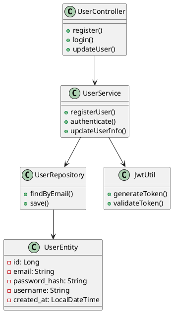
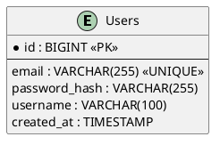
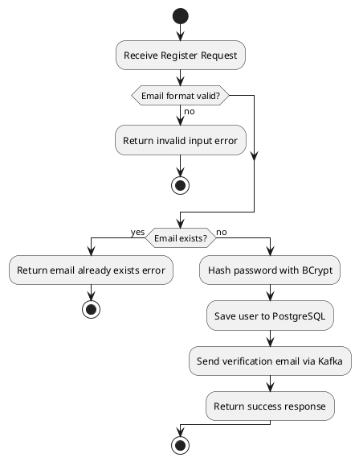
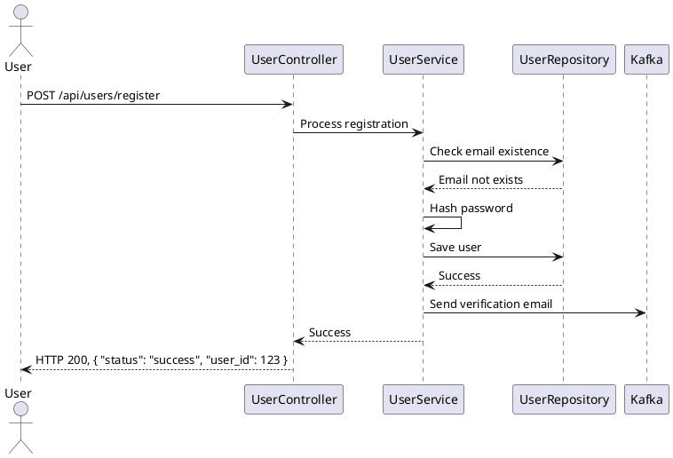
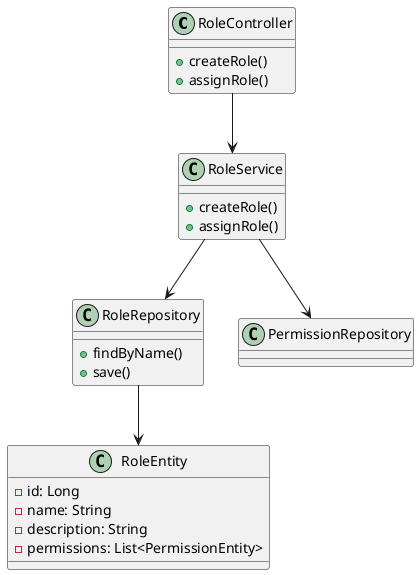
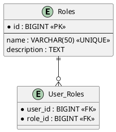
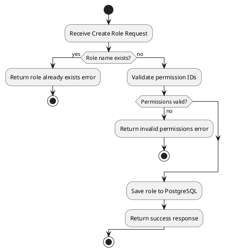

# 技术设计文档

## 1. 概述
本技术设计文档详细描述主服务程序的核心模块（用户管理、角色管理、权限管理及业务服务扩展）的实现方案，基于 Spring Boot 3.5.0 和 JDK 17 开发。文档提供类图设计、数据存储设计（包括 ER 图和数据库表设计）、流程图、时序图、接口定义、错误处理和依赖管理，为开发人员提供模块级设计指导。文档聚焦于高层设计，不包含类函数或伪代码，遵循系统架构设计文档中的高层次数据模型和接口定义。

## 2. 模块设计

### 2.1 用户管理模块
#### 2.1.1 模块概述
负责用户注册、登录及信息管理，采用 Spring Security 实现认证，BCrypt 加密密码，JWT 用于会话管理。

#### 2.1.2 类图设计


#### 2.1.3 数据存储设计
- **数据库表设计**:
  - **Users**:
    - `id`: BIGINT, 主键，自增。
    - `email`: VARCHAR(255), 唯一，非空，邮箱格式。
    - `password_hash`: VARCHAR(255), 非空，BCrypt 加密。
    - `username`: VARCHAR(100), 非空。
    - `created_at`: TIMESTAMP, 非空，默认当前时间。
    - 索引: `email` (唯一索引，优化查询性能)。
- **ER 图**:


#### 2.1.4 流程图 (用户注册)


#### 2.1.5 时序图 (用户注册)


#### 2.1.6 接口定义
- **POST /api/users/register**:
  - **Request**: `{ "email": "user@example.com", "password": "pass123", "username": "user1" }`
  - **Response**: `{ "status": "success", "user_id": 123 }`
  - **Description**: 注册新用户，验证邮箱唯一性，保存加密密码，异步发送验证邮件。
- **POST /api/users/login**:
  - **Request**: `{ "email": "user@example.com", "password": "pass123" }`
  - **Response**: `{ "status": "success", "token": "jwt_token" }`
  - **Description**: 用户登录，验证凭据，返回 JWT 令牌。
- **PUT /api/users/{id}**:
  - **Request**: `{ "username": "new_username" }`
  - **Response**: `{ "status": "success" }`
  - **Description**: 更新用户信息，需 JWT 认证，管理员可更新任意用户。

#### 2.1.7 错误处理
- **InvalidInputException**: HTTP 400，提示“邮箱格式无效”或“密码长度不足”。
- **EmailAlreadyExistsException**: HTTP 400，提示“邮箱已注册”。
- **AuthenticationFailureException**: HTTP 401，提示“登录凭据无效”。
- **DatabaseException**: HTTP 500，记录日志并触发重试机制。

#### 2.1.8 依赖管理
- Spring Security 6.3: 用户认证和密码加密。
- Spring Kafka: 异步邮件通知。
- Hibernate Validator: 输入验证。
- Redis: 会话存储。

### 2.2 角色管理模块
#### 2.2.1 模块概述
实现角色创建和分配功能，基于 RBAC 模型，支持管理员管理角色及其权限。

#### 2.2.2 类图设计


#### 2.2.3 数据存储设计
- **数据库表设计**:
  - **Roles**:
    - `id`: BIGINT, 主键，自增。
    - `name`: VARCHAR(50), 唯一，非空。
    - `description`: TEXT, 可空。
    - 索引: `name` (唯一索引，优化查询性能).
  - **User_Roles**:
    - `user_id`: BIGINT, 外键，引用 Users(id).
    - `role_id`: BIGINT, 外键，引用 Roles(id).
    - 主键: (`user_id`, `role_id`).
    - 索引: 复合索引 (`user_id`, `role_id`)，优化查询。
- **ER 图**:


#### 2.2.4 流程图 (角色创建)


#### 2.2.5 时序图 (角色创建)
```plantuml
@startuml
actor Admin
participant "RoleController" as Controller
participant "RoleService" as Service
participant "RoleRepository" as RoleRepo
participant "PermissionRepository" as PermRepo

Admin -> Controller: POST /api/roles
Controller -> Service: Create role
Service ->